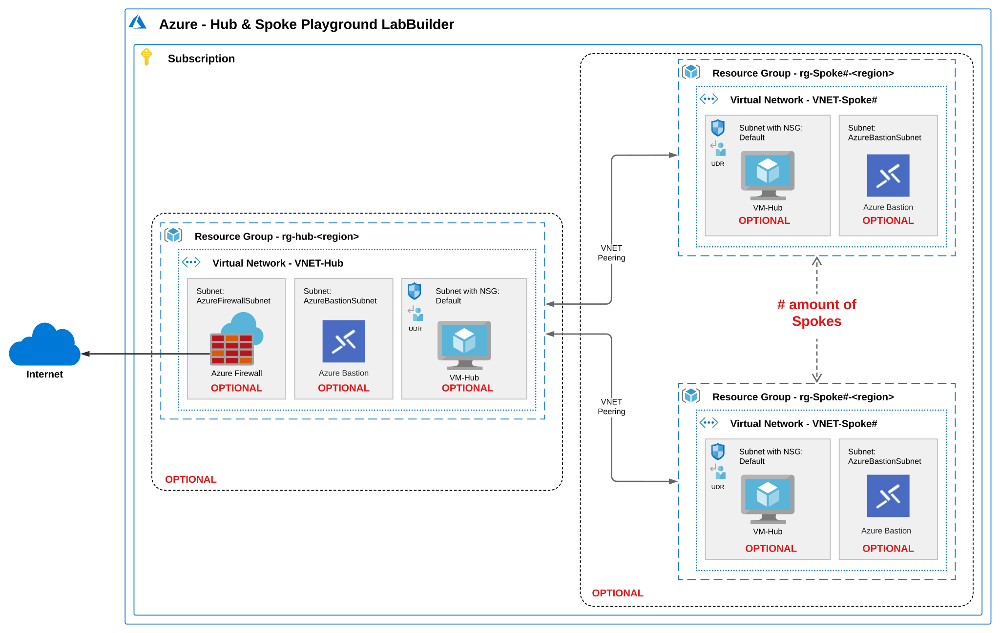

<h1>Hub or Azure Virtual WAN & Spoke playground - LAB Builder</h1>

## Table of contents

1. [Table of contents](#table-of-contents)
2. [Deploy to Azure](#deploy-to-azure)
3. [Description](#description)
4. [Scenario's](#scenarios)
   1. [Topology drawing - Hub \& Spoke](#topology-drawing---hub--spoke)
   2. [Topology drawing - Azure Virtual WAN](#topology-drawing---azure-virtual-wan)
5. [Deployment notes](#deployment-notes)
   1. [General](#general)
   2. [Subnet Ip Address range usage](#subnet-ip-address-range-usage)
   3. [Resource Names](#resource-names)
6. [Azure Monitor Agent, VM Insights and Dependency Agent](#azure-monitor-agent-vm-insights-and-dependency-agent)
7. [Azure Virtual Network Manager](#azure-virtual-network-manager)
8. [Parameters overview](#parameters-overview)
9. [Updates](#updates)
   1. [Aug/July 2024 updates](#augjuly-2024-updates)
   2. [Februari 2024 updates](#februari-2024-updates)
   3. [June 2023 updates](#june-2023-updates)
   4. [May 2023 updates](#may-2023-updates)
   5. [September 2022 updates](#september-2022-updates)
   6. [July 2022 updates](#july-2022-updates)
   7. [June 2022 updates](#june-2022-updates)
   8. [May 2022 updates](#may-2022-updates)

## Deploy to Azure

| Description | Template |
|---|---|
| Deploy to Azure Subscription ||

> :warning: **Warning:**
> **This deployment is meant for Demo, Test, Learning, Training, Practice or Reproduction purposes ONLY!!**
> **Please don't deploy to production environments!!**

## Description

This Lab Builder is built for testing, training, learning, reproduce and demo purposes which allows for quickly repeatable deployments of a Azure Hub & Spoke topology. All components like: Azure Virtual Machines, Azure Firewalls, Azure Virtual Network Gateways, Azure Bastion Hosts and the number of Spokes are optional making this deployment suitable for every scenario!

Optionaly you can deploy:

- Azure Firewall (Standard or Premium) in the Hub (VNET or vWAN) incl. Route table
- Azure Virtual network manager (AVNM) with Hub & Spoke topology and optionally Directly Connected network group.
- Virtual Machines in Spoke VNET's **
- Bastion Host in Hub VNET ****
- Azure Monitor Agent and Dependency Agent on Virtual Machines
- Azure Firewall rule Collection group which enables spoke-to-spoke and internet traffic.
- Simulated 'OnPremises' VNET with optional ***:
  - VPN Gateway
  - Site-2-Site VPN connection to Hub (VNET or vWAN)
  - Bastion Host
  - Virtual Machine

** On deployemnt you can specify the amount of Spoke VNET's to be deployed. VNET peerings will be deployed if both Hub and Spoke(s) are selected for deployement. When deploying together with AVNM the VNET peerings will be managed by AVNM.

*** To simulate OnPrem hybrid connectivity you can optionaly deploy a 'OnPrem' VNET. Optionaly deploy a Bastion Host, Virtual Machine and Virtual Network Gateway in the OnPrem VNET. When a Hub is also deployed with a VPN Gateway you can optionaly deploy a site-to-site VPN connection.

**** Azure Virtual Network Manager is onyl supported in 'VNET' Hub & Spoke topology.

## Scenario's

With LAB Builder you can deploy 4 **main** scenario's.

1. Only deploy **Spoke(s)**
2. Only deploy **VNET Hub** or **Azure Virtual Hub**
3. Deploy **Hub or vWAN Hub and Spoke(s)**
4. Deploy **Hub or vWAN Hub and Spoke(s)** and **OnPrem** simulating Hybrid connectivity

Within these **main** scenario's there are multiple options (but not limited to this):

|Scenrio|What gets deployed|
|-|-|
|**1. Only deploy Spokes**|- Resource Group (rg-Spoke#) - Virtual Network (VNET-Spoke#) - Network Security Group (NSG-Spoke#) linked to 'Default' Subnet - Subnet (Default) - [optional] Subnet (AzureBastionSubnet) - [optional] Subnet (AzureFirewallSubnet) - [optional] Azure Bastion Host (Bastion-Spoke#) incl. Public IP - [optional] Azure Virtual Machine (Windows)  *Only in combination with Firewall in Hub:* - Route table (RT-Hub) linked to 'Default' Subnet, with default route to Azure Firewall|
|**2. Only deploy Hub or vWAN Hub**|- Resource Group (rg-Hub) - Virtual Network (VNET-Hub) - [optional] Subnet (AzureBastionSubnet) - [optional] Subnet (AzureFirewallSubnet)  - [optional] Subnet (GatewaySubnet) - [optional] Azure Bastion Host (Bastion-Hub) incl. Public IP  - [optional] Azure Firewall (AzFw) incl. Public IP - [optional] Azure Firewall Policy (AzFwPolicy) - [optional] Azure Firewall Policy rule Collection Group - [optional] Virtual Network Gateway  *Only in combination with Firewall in Hub:* - Route table (RT-Hub) linked to 'Default' Subnet, with default route to Azure Firewall|
|**3. Deploy Hub or vWAN Hub and Spokes**|includes all from scenario 1 and 2, incl: - VNET Peerings|
|**4. Deploy Hub or vWAN Hub and Spokes + OnPrem**|includes all from scenario 1, 2 and 3 incl: - Resource Group (rg-OnPrem) - Virtual Network (VNET-OnPrem) - Network Security Group (NSG-OnPrem) linked to 'Default' Subnet - Subnet (Default) - [optional] Subnet (AzureBastionSubnet) - [optional] Subnet (GatewaySubnet) - [optional] Azure Bastion Host (Bastion-Hub) incl. Public IP - [optional] Azure Virtual Machine (Windows)  *Only in combination with Hub:* - [optional] Site-to-Site VPN Connection to Hub Gateway

### Topology drawing - Hub & Spoke

### Topology drawing - Azure Virtual WAN

## Deployment notes

### General

- VNET Connections will be deployed when vWAN Hub and Spokes are selected
- VNET Peering will be deployed when Hub and Spoke are selected
- ICMPv4 Firewall rule will be enabled on Virtual Machines
- Windows VM image is Windows Server 2022 Datacenter Gen2
- Linux VM image is Ubuntu Server 22.04 LTS Gen2
- Route table incl. Default routes (Private and Public) will be deployed in vWAN Hub if Azure Firewall is selected.  
- Route tables (UDR's) incl. Default route will be deployed if Azure Firewall is selected (0.0.0.0/0 -> Azure Firewall)
- Network Security group will be deplyed to 'default' subnets only
- At deployemt use a /16 subnet. every VNET (Hub and Spoke VNET's) will get a /24 subnet
- Hub VNET will always get the first available /24 address space. eg. 172.16.0.0/24
- Spoke(s) VNET gets subsequent address spaces. eg. 172.16.1.0/24, 172.16.2.0/24 etc.
- OnPrem VNET will always get the latest available /24 address space. eg. 172.16.255.0/24
- see subnet details:

### Subnet Ip Address range usage

*Spoke VNET's subnets:*

|Subnet Name|Subnet address range|notes|
|-|-|-|
|default|x.x.Y.0/26||
|AzureBastionSubnet|x.x.Y.64/26|Only when Bastion is selected|

*Hub VNET subnets:*

|Subnet Name|Subnet address range|notes|
|-|-|-|
|AzureFirewallSubnet|x.x.0.4/26|Only applicable for Hub VNET with Azure Firewall selected|
|AzureBastionSubnet|x.x.0.64/26|Only when Bastion is selected|
|GatewaySubnet|x.x.0.128/26|Only when Gateway is selected|

*Azure virtual WAN Hub subnet:*

|Subnet Name|Subnet address range|notes|
|-|-|-|
|n/a|x.x.0.0/24||

*OnPrem VNET subnets:*

|Subnet Name|Subnet address range|notes|
|-|-|-|
|default|x.x.255.0/26||
|AzureBastionSubnet|x.x.255.64/26|Only when Bastion is selected|
|GatewaySubnet|x.x.255.128/26|Only when Gateway is selected|

### Resource Names

|Type|Name|
|-|-|
|Hub VNET|VNET-Hub|
|Spoke VNET's|VNET-Spoke#|
|Spoke Virtual Machines|VM-Spoke#|
|Hub Route Table|RT-Hub|
|Spoke Route tables|RT-Spoke#|
|Hub Bastion Host|Bastion-Hub|
|Spoke Bastion Hosts|Bastion-Spoke#|
|Hub Network Security Group|NSG-Hub|
|Spoke Network Security Groups|NSG-Spoke#|
|Hub Azure Firewall|Firewall-Hub|
|Hub Virtual Network Gateway|Gateway-Hub|
|OnPrem VNET|VNET-OnPrem|
|OnPrem Virtual Machine|VM-OnPrem|
|OnPrem Bastion Host|Bastion-OnPrem|
|OnPrem Network Security Group|NSG-OnPrem|
|OnPrem Virtual Network gateway|Gateway-OnPrem|
|Azure Virtual Network Manager|LabBuilder-AVNM|

## Azure Monitor Agent, VM Insights and Dependency Agent

- Azure Monitor Agent will be deployed on all VM's (Windows and Linux)
- Data collection rule (DCR) will be deployed in Hub Resource group and associated with all VM's
- Data collection rule includes all configuration for VMInsights including Service Map (Dependency agent)
- Dependency Agent will be installed on Windows VM's only.

## Azure Virtual Network Manager

When deploying a Hub you can also deploy a Azure Virtual Network Manager (AVNM). AVNM will be deployed in the HUB resource group and will add the Spoke VNET's as 'static' members of the Network Group. Connectivity configuration is added to support HUB&Spoke topology. Configuration will be deployed using a Deployment Script and User Assigned Identity.

> :warning: **Warning:**
> You will need to have 'Owner' rights on the HUB resource group to deploy AVNM. 
> The deployment script will create a User Assigned Identity and assign the 'Network Contributor' role to the HUB resource group.
> This is required to run the Deployment Script which deploys the AVNM configuration.

## Parameters overview

| Parameter Name | Type | Description | DefaultValue | Possible values |
| :-- | :-- | :-- | :-- | :-- |
| `AddressSpace` | string | IP Address space used for VNETs in deployment. Only enter a /16 subnet. Default = 172.16.0.0/16 | 172.16.0.0/16 |  |
| `adminPassword` | secureString | Admin Password for VM |  |  |
| `adminUsername` | string | Admin username for VM |  |  |
| `amountOfSpokes` | int | Amount of Spoke VNETs you want to deploy. Default = 2 | 2 |  |
| `AzureFirewallTier` | string | Azure Firewall Tier: Standard or Premium | Standard | `Standard` or `Premium` |
| `bastionInHubSKU` | string | Hub Bastion SKU | Basic | `Basic` or `Standard` |
| `bastionInOnPremSKU` | string | OnPrem Bastion SKU | Basic | `Basic` or `Standard` |
| `bastionInSpokeSKU` | string | Spoke Bastion SKU | Basic | `Basic` or `Standard` |
| `deployBastionInHub` | bool | Deploy Bastion Host in Hub VNET | False |  |
| `deployBastionInOnPrem` | bool | Deploy Bastion Host in OnPrem VNET | True |  |
| `deployBastionInSpoke` | bool | Deploy Bastion Host in every Spoke VNET | False |  |
| `deployFirewallInHub` | bool | Deploy Azure Firewall in Hub VNET. includes deployment of custom route tables in Spokes and Hub VNETs | True |  |
| `deployFirewallrules` | bool | Deploy Firewall policy Rule Collection group which allows spoke-to-spoke and internet traffic | True |  |
| `deployGatewayInHub` | bool | Deploy Virtual Network Gateway in Hub VNET | True |  |
| `deployGatewayinOnPrem` | bool | Deploy Virtual Network Gateway in OnPrem VNET | True |  |
| `deployHUB` | bool | Deploy Hub | True |  |
| `deployOnPrem` | bool | Deploy Virtual Network Gateway in OnPrem | True |  |
| `deploySiteToSite` | bool | Deploy Site-to-Site VPN connection between OnPrem and Hub Gateways | True |  |
| `deploySpokes` | bool | Deploy Spoke VNETs | True |  |
| `deployUDRs` | bool | Dploy route tables (UDR's) to VM subnet(s) in Hub and Spokes | True |  |
| `deployVMinOnPrem` | bool | Deploy VM in OnPrem VNET | True |  |
| `deployVMsInSpokes` | bool | Deploy VM in every Spoke VNET | True |  |
| `diagnosticWorkspaceId` | string | Workspace ID of exsisting LogAnalytics Workspace | | |
| `firewallDNSproxy` | bool | Enable Azure Firewall DNS proxy | False | |
| `hubBgp` | bool | Enable BGP on Hub Gateway | True |  |
| `hubBgpAsn` | int | Hub BGP ASN | 65010 |  |
| `hubRgName` | string | Hub resource group pre-fix name | rg-hub |  |
| `hubSubscriptionID` | string | SubscriptionID for HUB deployemnt | [subscription().subscriptionId] |  |
| `hubType` | string | Deploy Hub VNET or Azuere vWAN | VWAN | `VNET` or `VWAN` |
| `location` | string | Azure Region. Defualt = Deployment location | [deployment().location] |  |
| `onpremBgp` | bool | Enable BGP on OnPrem Gateway | True |  |
| `onpremBgpAsn` | int | OnPrem BGP ASN | 65020 |  |
| `onpremRgName` | string | OnPrem Resource Group Name | rg-onprem |  |
| `onPremSubscriptionID` | string | SubscriptionID for OnPrem deployemnt | [subscription().subscriptionId] |  |
| `osTypeHub` | string | Hub Virtual Machine OS type. Windows or Linux. Default = Windows | Windows | `Windows` or `Linux` |
| `osTypeOnPrem` | string | OnPrem Virtual Machine OS type. Windows or Linux. Default = Windows | Windows | `Windows` or `Linux` |
| `osTypeSpoke` | string | Spoke Virtual Machine(s) OS type. Windows or Linux. Default = Windows | Windows | `Windows` or `Linux` |
| `sharedKey` | secureString | Site-to-Site ShareKey |  |  |
| `spokeRgNamePrefix` | string | Spoke resource group prefix name | rg-spoke |  |
| `spokeSubscriptionID` | string | SubscriptionID for Spoke deployemnt | [subscription().subscriptionId] |  |
| `tagsByResource` | object | Tags by resource types |  |  |
| `vmSizeHub` | string | Hub Virtual Machine SKU. Default = Standard_B2s | Standard_B2s |  |
| `vmSizeOnPrem` | string | OnPrem Virtual Machine SKU. Default = Standard_B2s | Standard_B2s |  |
| `vmSizeSpoke` | string | Spoke Virtual Machine SKU. Default = Standard_B2s | Standard_B2s |  |
| `deployVnetPeeringMesh` | bool | Directly connect VNET Spokes (Fully Meshed Topology) with standard VNET Peerings. When using AVNM the Directly Connected Group will be used. | False | |
| `deployVnetPeeringAVNM` | bool | Deploy Azure Virtual Network Manager | False | |
| `internetTrafficRoutingPolicy` | bool | Enable Internet traffic vWAN routing policy on Azure Firewall | False | |
| `privateTrafficRoutingPolicy` | bool | Enable Private traffic vWAN routing policy on Azure Firewall | False | |

## Updates

### Aug/July 2024 updates

- Updated Bicep code to use safe-access operator (?.) and null-coalescing operator (??)
- Updated Resources API's to latest version
- Add support for Azure Bastion Premium SKU
- Modified VNET deployment so Default subnet is optional
- Updated UI Definition; Removed 'deploy VM in Hub option'
- Updated UI Definition; Added Azure Bastion Premium Option
- Removed Default subnet in HUB VNET deployment
- Removed option to deploy VM in HUB VNET (Default subnet)
- Removed specific routes to Default subnet in HUB in Route tables
- Resized Subnets to use /26 instead of a mix of /26 and /27
- Updated validation and error description of BGP ASN usage in UI definition to make it more clear
- Changed default values for BGP ASN's (for VNET deployment = 65010, VWAN deployment = 65515, OnPrem deployment = 65020)
- Removed 'Deploy Bastion to Spokes'
- Removed VNET peering fully meshed option (Deploy AVNM instead and use direct connected group)
- Removed batched deployment of vWAN vnet connections
- Modify parameter files for testing to not include Hub VM's anymore
- Update README

### Februari 2024 updates

- Enable Azure vWAN Routing Intent Policy with Azure Firewall
- Update Bicep code to use function CIDRSubet and CIDRHost

### June 2023 updates

- Deploy Azure Virtual Network Manager (AVNM) to manage VNET Peerings

### May 2023 updates

- Deploy Azure Monitor Agent on Windows and Linux VM's
- Deploy Dependency Agent (Service Map) on Windows VM's
- Deploy Data Collections Rule (DCR) with VMInsights (Performance and Map) enabled
- Select an existing Log Analytics Workspace to be used with AMA/DA and DCR
- Deploy VNET peerings between Spoke VNET's in a fully Meshed topology

### September 2022 updates

- Enable Azure Firewall DNS proxy and set VNET DNS to Firewall IP address
- Enable Diagnostic settings to log to existing LogAnalytics workspace
- Deploy Microsoft Monitoring agent if existing LogAnalytics is selected

### July 2022 updates

- Multi Subscription deployment. You can now specify different Subscriptions for HUB, Spokes and Onprem deployments
- Virtual machine Sizes. You can now specify different VM Sizes for HUB, Spokes and OnPrem deployments
- Vitual machine Os Types. You can now specify Windows or Linux for HUB, Spokes and OnPrem deployments
- Bastion Host SKU Types. You van noew specify Bastion SKU Basic or Standard for HUB, Spokes and OnPrem deployments
- Updated this ReadMe file

### June 2022 updates

- BGP support for VPN site-to-site (VNET and vWAN)
- Azure Virtual WAN support. Choose between Azure vWAN or VNET for Hub deployments

### May 2022 updates

- Add default Firewall Network & Application rules
- Deploy separate VNET (simulate OnPrem) and deploy VPN gateways including Site-to-Site tunnel
- remove static Resource Group names
- use CIDR notation as Address Space (Instead of first two octets
- Virtual machine OS Type. Windows and Linux support
- Virtual Machine SKU size selection
- Virtual machine boot diagnostics (Managed storage account)
- Virtual machine delete option of Disk and Nic
- Tags support for resources deployed

