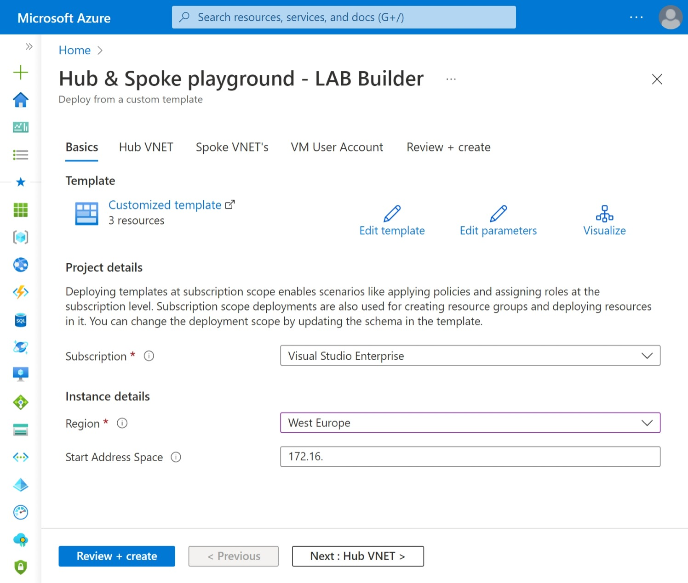
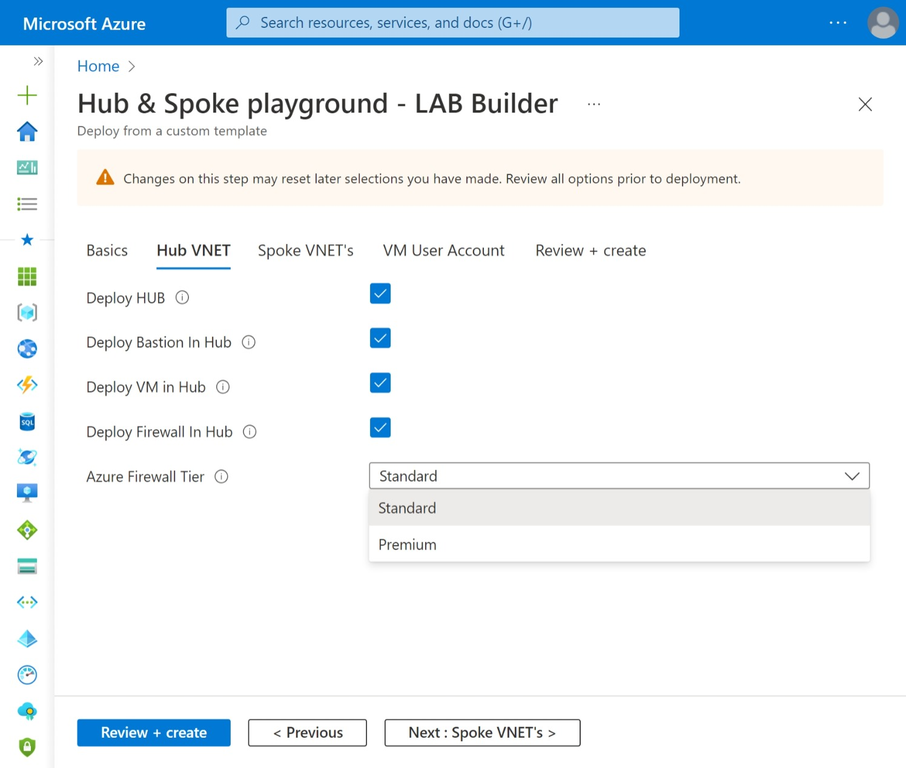
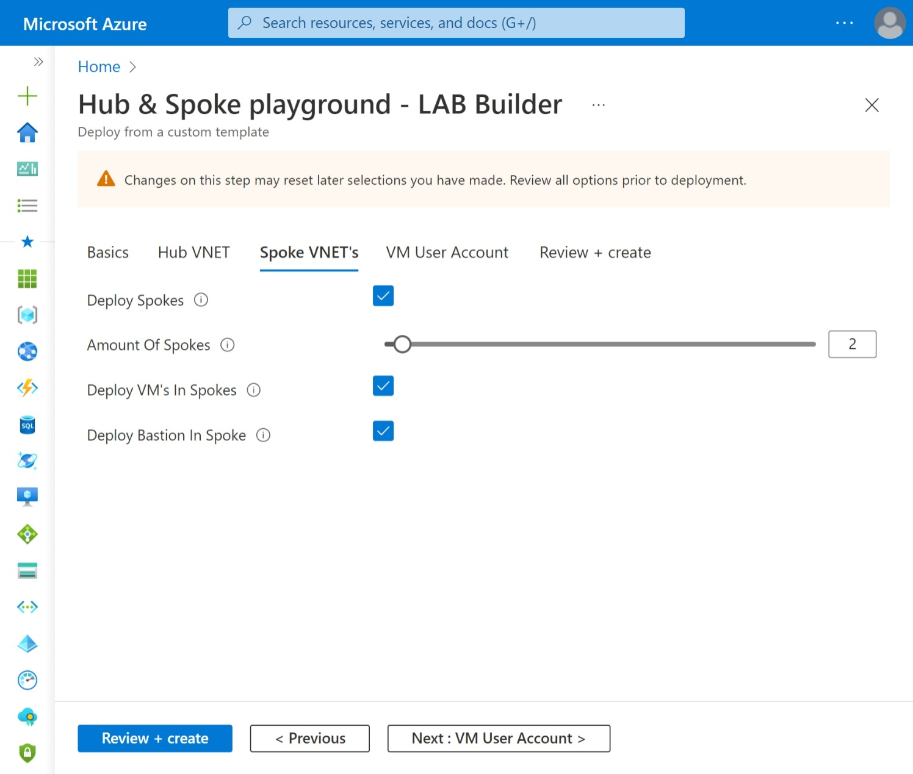
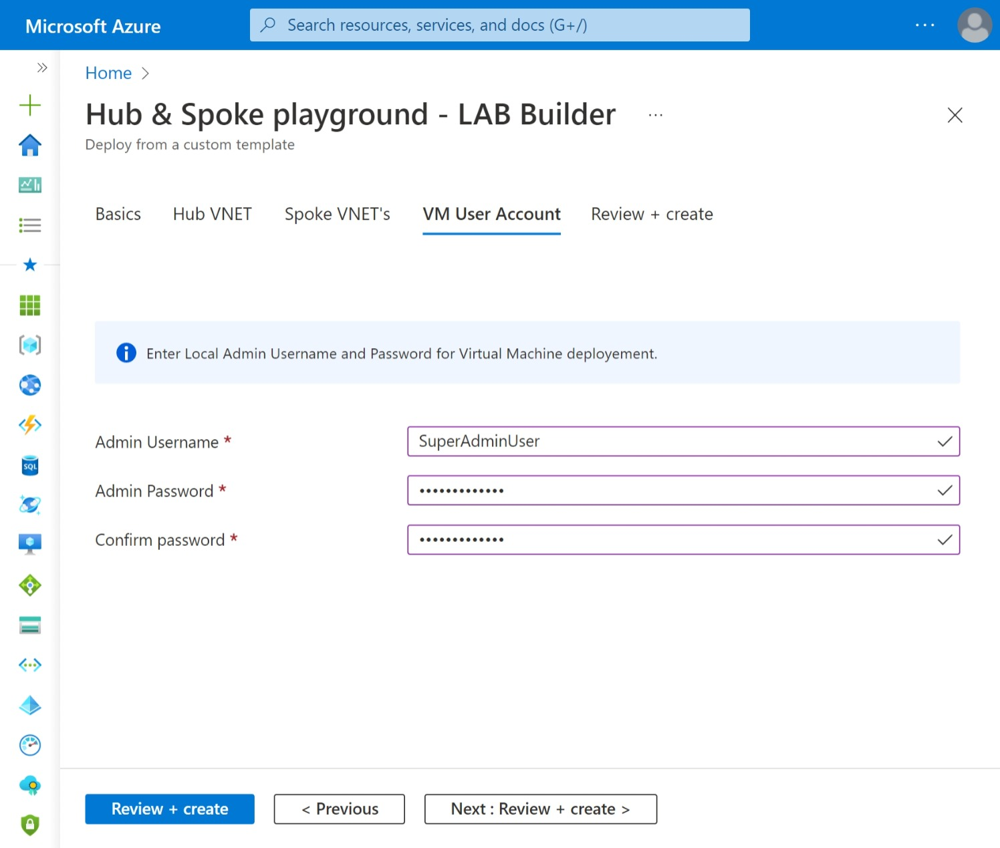
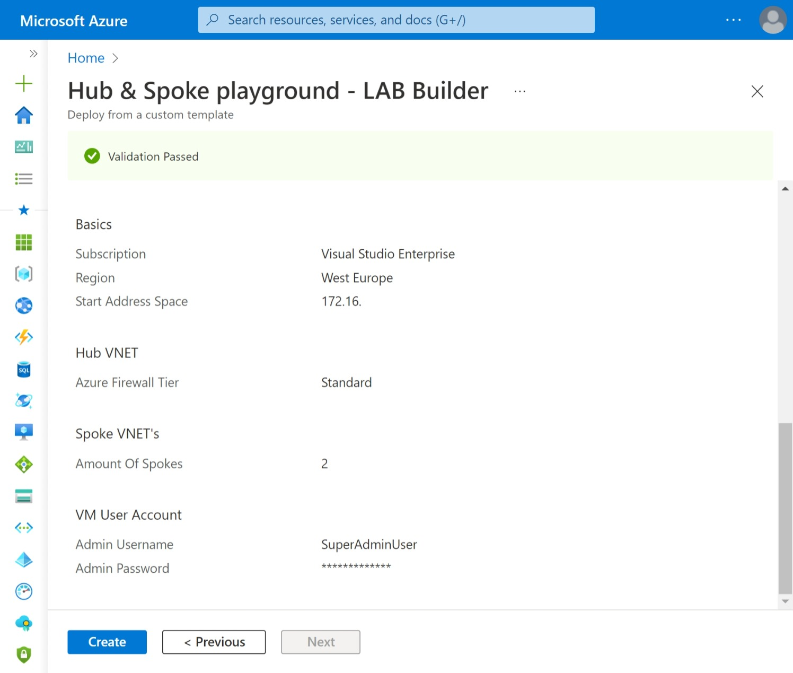

# Hub & Spoke playground - LAB Builder

## Deploy to Azure

| Description | Template |
|---|---|
| Deploy to Azure Subscription ||

## Introduction

In my daily work I've created, numourous times, a (semi-)manual Hub & Spoke topology for Testing, (Self)Training, Demo or Reproduction purposes. I've always done this via multiple ways, like: PowerShell scripts, Azure CLI, ARM or Azure Potal GUI..... but bottom line: Wathever option is fine by me as long as it has the least amount of effort to build it. ;)

With that in mind I've created a "Hub & Spoke playground Lab builder" so you'll be able to deploy Hub & Spoke scenario's in notime :) It takes approx. 20min to deploy a 'full option Hub & Spoke' deployment with 2 Spoke VNET's.

> :warning: Warning:
> **This deployment is ment for Testing, Training, Practice or Reproduction purposes ONLY!!**
> Please don't deploy to production environments!!

## Description/Guidance

With this 'Hub & Spoke playground - LAB Builder' you'll be able to deploy Hub & Spoke topologies in various ways.

Optionaly you can deploy Azure Firewall (Standard or Premium) in Hub VNET incl. Route table, deploy Virtual Machine in Hub VNET and/or Spoke VNET's and deploy Bastion Host in Hub VNET and/or Spoke VNET's. On deployemnt you can specify the amount of Spoke VNET's to be deployed. VNET peerings will be deployed if both Hub and Spoke(s) are selected for deployement.

### LABbuilder scenario's

With LABbuilder you can deploy three **main** scenario's.

1. Only deploy **Spoke(s)**
2. Only deploy **Hub**
3. Deploy **Hub and Spoke(s)**

Within these three **main** scenario's there are multiple options:

|Scenrio|What gets deployed|
|-|-|
|**1. Only deploy Spokes**|- Resource Group (rg-Spoke#) - Virtual Network (VNET-Spoke#) - Network Security Group (NSG-Spoke#) linked to 'Default' Subnet - Subnet (Default) - [optional] Subnet (AzureBastionSubnet) - [optional] Subnet (AzureFirewallSubnet) - [optional] Azure Bastion Host (Bastion-Spoke#) incl. Public IP - [optional] Azure Virtual Machine (Windows)  *Only in combination with Firewall in Hub:* - Route table (RT-Hub) linked to 'Default' Subnet, with default route to Azure Firewall|
|**2. Only deploy Hub**|- Resource Group (rg-Hub) - Virtual Network (VNET-Hub) - Network Security Group (NSG-Hub) linked to 'Default' Subnet - Subnet (Default) - [optional] Subnet (AzureBastionSubnet) - [optional] Subnet (AzureFirewallSubnet) - [optional] Azure Bastion Host (Bastion-Hub) incl. Public IP  - [optional] Azure Firewall (AzFw) incl. Public IP - [optional] Azure Firewall Policy (AzFwPolicy) - [optional] Azure Virtual Machine (Windows)  *Only in combination with Firewall in Hub:* - Route table (RT-Hub) linked to 'Default' Subnet, with default route to Azure Firewall|
|**3. Deploy Hub and Spokes**|includes all from scenario 1 and 2, incl: - VNET Peerings|

## Topology drawing

## Deployment Steps

|Step|Screenshot|
|-|-|
|Select Subscription and Region Enter the first two octets of a **/16** subnet example: **172.16.**||
|Deploy Hub Optional enable: - Azure Bastion - Virtual Machine - Azure Firewall Standard or Premium||
|Deploy Spokes Enter amount of Spokes to deploy (Max 25) Optional enable: - Virtual Machine - Azure Bastion   *Note: VM and Azure Bastion will be deployed in every Spoke*||
|Enter Local Admin credentials If Virtual Machine is selected for Hub and/or Spoke||
|Validate and Deploy||

## Appendix

### Parameters

|Parameter name|type|default value|notes|
|-|-|-|-|
|adminUsername|string|n/a|Admin username for VM|
|adminPassword|secure string|n/a|Admin password for VM|
|startAddressSpace|string|172.16.|IP Address space used for VNETs in deployment. Only enter the two first octets of a /16 subnet. Default = 172.16.|
|location|string|deployment().location|Azure Region. Defualt = Deployment location|
|deploySpokes|bool|true|Deploy Spoke VNETs|
|amountOfSpokes|int|2|Amount of Spoke VNETs you want to deploy. Default = 2|
|deployVMsInSpokes|bool|true|Deploy VM in every Spoke VNET|
|deployBastionInSpoke|bool|false|Deploy Bastion Host in every Spoke VNET|
|DeployHUB|bool|true|bool|Deploy Hub VNET|
|deployBastionInHub|bool|true|Deploy Bastion Host in Hub VNET|
|deployVMinHub|bool|true|Deploy VM in Hub VNET|
|deployFirewallInHub|bool|true|Deploy Azure Firewall in Hub VNET. Includes deployment of custom route tables in Spokes and Hub VNETs|
|AzureFirewallTier|string|Standard|Azure Firewall Tier: Standard or Premium|

> :warning:
> **This deployment is for Testing, Demo-ing, (self)Training, Practice or Reproduction purposes ONLY!!**
> **Don't deploy to production environments!!**

### ~~Backlog~~... whishlist items

- Choose between Azure vWAN and Hub & Spoke
- Add default Firewall Network & Application rules
- Deploy separate VNET (simulate OnPrem) and deploy VPN gateways including Site-to-Site tunnel
- etc...