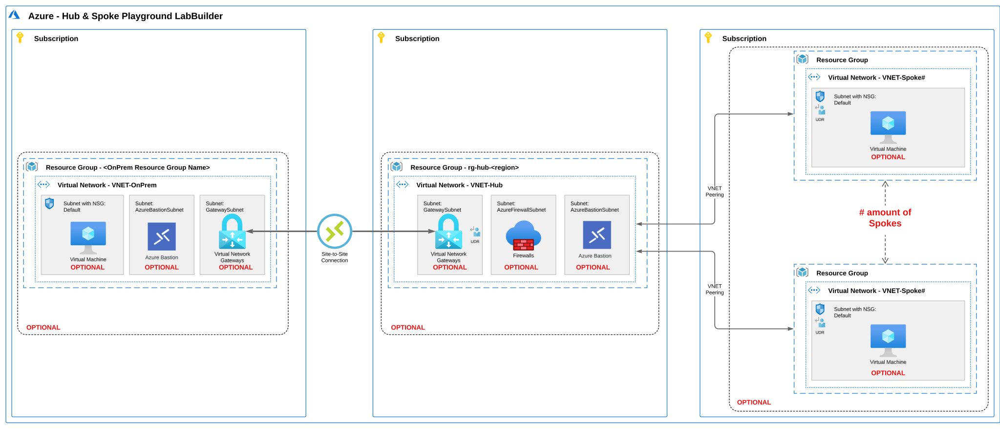

# Hub & Spoke playground - LAB Builder

## Index

- [Hub & Spoke playground - LAB Builder](#hub--spoke-playground---lab-builder)
  - [Index](#index)
  - [Deploy to Azure](#deploy-to-azure)
  - [Introduction](#introduction)
  - [Description](#description)
  - [LABbuilder scenario's](#labbuilder-scenarios)
  - [Topology drawing](#topology-drawing)
  - [Deployment Steps](#deployment-steps)
  - [Deployment notes](#deployment-notes)
  - [Resource Names](#resource-names)
  - [Appendix](#appendix)
    - [Parameters](#parameters)
    - [~~Backlog~~... whishlist items](#backlog-whishlist-items)

## Deploy to Azure

| Description | Template |
|---|---|
| Deploy to Azure Subscription ||

> :warning: **Warning:**
> **This deployment is ment for Demo, Test, Learning, Training, Practice or Reproduction purposes ONLY!!**
> **Please don't deploy to production environments!!**

## Introduction

In my daily work I've created numourous times a (semi-)manual Hub & Spoke topology for Testing, (Self)Training, Demo or Reproduction purposes. I've always done this in multiple ways, like: PowerShell scripts, Azure CLI, ARM or Azure Potal GUI.....whatever was the best fit. But bottom line: Wathever option is fine by me as long as it has the least amount of effort to build it.

With that in mind I've created a "Hub & Spoke playground Lab builder" so you'll be able to deploy Hub & Spoke scenario's in notime :) It takes approx. 20min to deploy a 'full option Hub & Spoke' deployment with 2 Spoke VNET's.

## Description

With this 'Hub & Spoke playground - LAB Builder' you'll be able to deploy Hub & Spoke topologies in various ways.

Optionaly you can deploy Azure Firewall (Standard or Premium) in Hub VNET incl. Route table, deploy Virtual Machine in Hub VNET and/or Spoke VNET's and deploy Bastion Host in Hub VNET and/or Spoke VNET's. On deployemnt you can specify the amount of Spoke VNET's to be deployed. VNET peerings will be deployed if both Hub and Spoke(s) are selected for deployement.

## LABbuilder scenario's

With LABbuilder you can deploy 4 **main** scenario's.

1. Only deploy **Spoke(s)**
2. Only deploy **Hub**
3. Deploy **Hub and Spoke(s)**
4. Deploy **Hub and Spoke(s)** and **OnPrem** simulating Hybrid connectivity

Within these three **main** scenario's there are multiple options:

|Scenrio|What gets deployed|
|-|-|
|**1. Only deploy Spokes**|- Resource Group (rg-Spoke#) - Virtual Network (VNET-Spoke#) - Network Security Group (NSG-Spoke#) linked to 'Default' Subnet - Subnet (Default) - [optional] Subnet (AzureBastionSubnet) - [optional] Subnet (AzureFirewallSubnet) - [optional] Azure Bastion Host (Bastion-Spoke#) incl. Public IP - [optional] Azure Virtual Machine (Windows)  *Only in combination with Firewall in Hub:* - Route table (RT-Hub) linked to 'Default' Subnet, with default route to Azure Firewall|
|**2. Only deploy Hub**|- Resource Group (rg-Hub) - Virtual Network (VNET-Hub) - Network Security Group (NSG-Hub) linked to 'Default' Subnet - Subnet (Default) - [optional] Subnet (AzureBastionSubnet) - [optional] Subnet (AzureFirewallSubnet)  - [optional] Subnet (GatewaySubnet) - [optional] Azure Bastion Host (Bastion-Hub) incl. Public IP  - [optional] Azure Firewall (AzFw) incl. Public IP - [optional] Azure Firewall Policy (AzFwPolicy) - [optional] Azure Firewall Policy rule Collection Group - [optional] Azure Virtual Machine (Windows) - [optional] Virtual Network Gateway  *Only in combination with Firewall in Hub:* - Route table (RT-Hub) linked to 'Default' Subnet, with default route to Azure Firewall|
|**3. Deploy Hub and Spokes**|includes all from scenario 1 and 2, incl: - VNET Peerings|
|**4. Deploy Hub and Spokes + OnPrem**|includes all from scenario 1, 2 and 3 incl: - Resource Group (rg-OnPrem) - Virtual Network (VNET-OnPrem) - Network Security Group (NSG-OnPrem) linked to 'Default' Subnet - Subnet (Default) - [optional] Subnet (AzureBastionSubnet) - [optional] Subnet (GatewaySubnet) - [optional] Azure Bastion Host (Bastion-Hub) incl. Public IP - [optional] Azure Virtual Machine (Windows)  *Only in combination with Hub:* - [optional] Site-to-Site VPN Connection to Hub Gateway

## Topology drawing

## Deployment Steps

|Step|Screenshot|
|-|-|
|Select Subscription and Region Enter the a **/16** subnet example: **172.16.0.0/16**  *Note: Hub VNET will always get the first available /24 subnet, first spoke the second subnet etc. like: 172.16.0.0/24 = Hub VNET 172.16.1.0/24 = Spoke1 172.16.2.0/24 = Spoke2 etc.*||
|Deploy Hub Optional enable: - Azure Bastion - Azure Firewall Standard or Premium - Azure Firewall Policy rule Collection group||
|Deploy Spokes Enter resource group prefix name Enter amount of Spokes to deploy (Max 25) Optional enable: - Azure Bastion   *Note: VM and Azure Bastion will be deployed in every Spoke*||
|Deploy a simulated OnPrem incl. Hybrid Connectivity. Enter resource group name Optional enable: - Azure Bastion - Virtual Network Gateway - Site-to-Site connection between OnPrem and Hub||
|Enable Virtual Machine deployment in Hub, Spoke or OnPrem.  Enter Local Admin credentials If Virtual Machine is selected for Hub and/or Spoke||
|Validate and Deploy||

## Deployment notes

- VNET Peering will be deployed when Hub and Spoke are selected
- ICMPv4 Firewall rule will be enabled on Virtual Machines
- Route tables incl. Default route will be deployed if Azure Firewall is selected (0.0.0.0/0 -> Azure Firewall)
- Network Security group will be deplyed to 'default' subnets only
- At deployemt use a /16 subnet. every VNET (Hub and Spoke VNET's) will get a /24 subnet
- Hub VNET will always get the first available /24 subnet, first spoke the second subnet etc. see subnet details:

*Spoke VNET's subnets:*

|Subnet Name|Subnet address range|notes|
|-|-|-|
|default|x.x.Y.0/26||
|AzureBastionSubnet|x.x.Y.128/27|Only when Bastion is selected|

*Hub VNET subnets:*

|Subnet Name|Subnet address range|notes|
|-|-|-|
|default|x.x.0.0/26||
|AzureFirewallSubnet|x.x.0.64/26|Only applicable for Hub VNET with Azure Firewall selected|
|AzureBastionSubnet|x.x.0.128/27|Only when Bastion is selected|

## Resource Names

|Type|Name|
|-|-|
|Hub VNET|VNET-Hub|
|Spoke VNET's|VNET-Spoke#|
|Hub Virtual Machine|VM-Hub|
|Spoke Virtual Machines|VM-Spoke#|
|Hub Route Table|RT-Hub|
|Spoke Route tables|RT-Spoke#|
|Hub Bastion Host|Bastion-Hub|
|Spoke Bastion Hosts|Bastion-Spoke#|
|Hub Network Security Group|NSG-Hub|
|Spoke Network Security Groups|NSG-Spoke#|
|Hub Azure Firewall|Firewall-Hub|
|Hub Virtual Network Gateway|Gateway-Hub|
|OnPrem VNET|VNET-OnPrem|
|OnPrem Virtual Machine|VM-OnPrem|
|OnPrem Bastion Host|Bastion-OnPrem|
|OnPrem Network Security Group|NSG-OnPrem|
|OnPrem Virtual Network gateway|Gateway-OnPrem|

## Appendix

### Parameters

|Parameter name|type|default value|notes|
|-|-|-|-|
|adminUsername|string|n/a|Admin username for VM|
|adminPassword|secure string|n/a|Admin password for VM|
|AddressSpace|string|172.16.0.0/16|IP Address space used for VNETs in deployment. Only enter a /16 subnet. Default = 172.16.0.0/16|
|location|string|deployment().location|Azure Region. Defualt = Deployment location|
|deploySpokes|bool|true|Deploy Spoke VNETs|
|spokeRgNamePrefix|string|rg-spoke|Spoke Resource Group prefix name. With default value set, spoke resource groups will be: rg-spoke1, rg-spoke2 etc.|
|amountOfSpokes|int|2|Amount of Spoke VNETs you want to deploy. Default = 2|
|deployVMsInSpokes|bool|true|Deploy VM in every Spoke VNET|
|deployBastionInSpoke|bool|false|Deploy Bastion Host in every Spoke VNET|
|deployHUB|bool|true|bool|Deploy Hub VNET|
|hubRgName|string|rg-hub|Hub Resource Group Name
|deployBastionInHub|bool|true|Deploy Bastion Host in Hub VNET|
|deployVMinHub|bool|true|Deploy VM in Hub VNET|
|deployFirewallInHub|bool|true|Deploy Azure Firewall in Hub VNET. Includes deployment of custom route tables in Spokes and Hub VNETs|
|AzureFirewallTier|string|Standard|Azure Firewall Tier: Standard or Premium|
|deployFirewallrules|bool|false|Deploy firewall policy rule collection group which enables spoke-to-spoke traffic and internet traffic|
|deployOnPrem|bool|false|Deploy OnPrem VNET|
|onpremRgName|string|rg-onprem|OnPrem Resource Group Name|
|deployBastionInOnPrem|bool|false|Deploy Bastion Host in OnPrem VNET|
|deployVMinOnPrem|bool|false|Deploy VM in OnPrem VNET|
|deployGatewayinOnPrem|bool|false|Deploy Virtual Network Gateway in OnPrem VNET|
|deploySiteToSite|bool|false|Deploy Site-to-Site VPN Connection between OnPrem and Hub VNET|

### ~~Backlog~~... whishlist items

- Choose between Azure vWAN and Hub & Spoke
- ~~Add default Firewall Network & Application rules~~
- ~~Deploy separate VNET (simulate OnPrem) and deploy VPN gateways including Site-to-Site tunnel~~
- ~~remove static Resource Group names~~
- ~~use CIDR notation as Address Space (Instead of first two octets)~~
- etc...